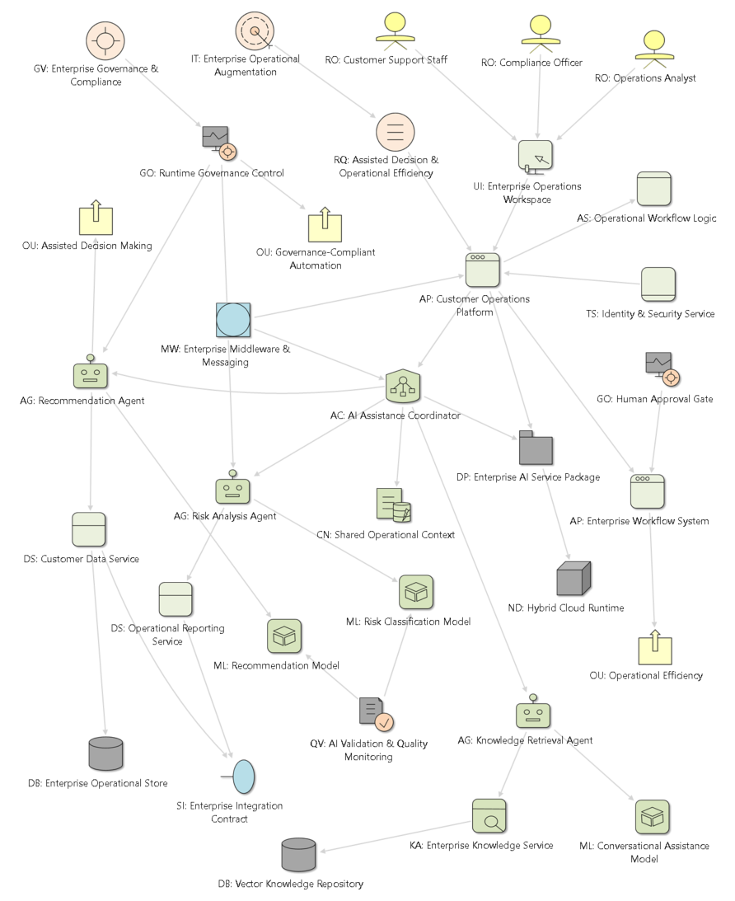
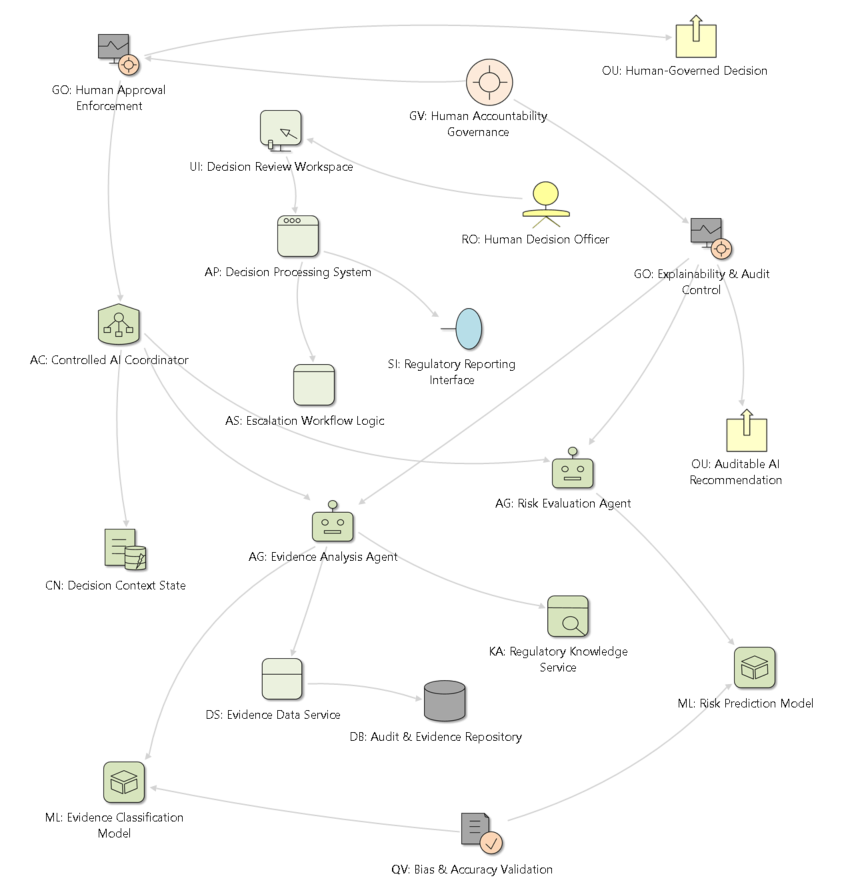

# AI-Augmented Solution Architecture (AASA)

---

## Overview

AASA (AI-Augmented Solution Architecture) adopts a more augmented, integrative, absorptive, evolutionary, hybrid, or fused approach to AI enterprise solutions, compared with the AI-first orientation of AISA (AI-Native Solution Architecture, see this [link](https://github.com/seniorgu/aisa/blob/main/docs/aisa-specification.md)). It is positioned as an enterprise AI absorption and coexistence architecture, aiming to maintain architectural continuity while enabling AI augmentation.

## AASA Architectural Approach 

AASA’s architectural approaches include:

- **AI absorption approach (beyond AI adoption):** progressing from adopted intelligence toward owned intelligence

- **Coexistence of operational modes:** supporting autonomy, semi-autonomy, automation, and semi-automation to enable gradual augmentation

- **Governance-heavy control:** emphasizing stronger governance mechanisms beyond the validation and adaptation focus of AISA (AI Solution Architecture)

- **System integration focus:** addressing integration challenges in heterogeneous enterprise environments

- **Enterprise alignment:** stronger alignment with business requirements, data strategies, and organizational assurance objectives

## AASA Modeling Elements

As an AI-augmented architectural approach, AASA incorporates both non-AI elements and AI-specific elements (which are heavily emphasized in AISA). As a result, AASA operates on a mixed set of AI and non-AI elements, including a shared subset with AISA. Table 1 presents the primary AI and non-AI elements of AASA.

| **Element Name**    | **AI-Specific** | **Definition**                                                                                                                             |
| ------------------- | --------------- | ------------------------------------------------------------------------------------------------------------------------------------------ |
| Access Interface    |                 | Represents the interaction channels, UI/UX surfaces, and entry points through which humans engage with the solution.                       |
| Application         |                 | Represents a bounded software system, enterprise application, or business component that integrates with or consumes AI capabilities.      |
| App Logic           |                 | Represents explicitly defined non-GUI logic, control flow, or compositional behavior of an application.                                    |
| Data Service        |                 | Represents services responsible for data access, integration, transformation, federation, and transactional integrity.                     |
| Technical Component |                 | Represents reusable technical capabilities, utility services, and cross-cutting infrastructure functions available across the solution.    |
| AI Agent            | Yes             | Represents an autonomous AI entity capable of goal-directed reasoning, planning, and action.                                               |
| AI Coordinator      | Yes             | Represents the coordination logic, workflow control, and multi-agent management that sequences and routes AI operations.                   |
| Context State       | Yes             | Represents the mechanisms for managing conversational state, memory, prompt engineering, and interaction coherence.                        |
| AI Model            | Yes             | Represents the models, inference engines, and reasoning frameworks that generate predictions, decisions, or outputs.                       |
| Knowledge Service   | Yes             | Represents the semantic retrieval, RAG, embedding, and knowledge management capabilities that ground AI responses in relevant information. |
| AI/ML Lifecycle     | Yes             | Represents the lifecycle management processes for model training, experimentation, versioning, and deployment.                             |
| Autonomous Tool     | Yes             | Represents external functions, plugins, and third-party services that extend AI capabilities through invocation.                           |

*Table 1: Primary AASA Elements*

For the full list of AASA modeling elements and its foundational AI-ESA specifications, refer to this [link](https://github.com/seniorgu/ai-esa/blob/main/docs/ai-esa-specification.md).

AASA architectural services can be categorized into three types: fully autonomous applications, agentic applications with varying degrees of autonomy, and deterministic automation applications.

---

## AASA Example

Here are examples of AASA modeling cases.

### Canonical Case Example

Figure 1 illustrates an AASA for an AI-Augmented Enterprise Operations Platform. This example demonstrates:

- AI augmentation instead of replacement,

- coexistence with enterprise systems,

- governance-heavy architecture,

- hybrid operational control,

- human approval boundaries,

- enterprise integration continuity.

*Figure 1: AASA for an AI-Augmented Enterprise Operations Platform*

### Edge Case Example

Figure 2 shows AASA edge case for a High-Risk Human-Governed AI Decision Environment. This edge case demonstrates:

- constrained autonomy,

- governance escalation,

- partial AI delegation,

- operational safeguards.

*Figure 2: AASA Edge Case Example*

---

## Related Model Specification and Architecture

AASA uses the AI-ESA (AI Enterprise Solution Architecture) specification for modeling and maintains a close relationship with AISA (AI Solution Architecture).

For the relationship and relevance among AI-ESA, AISA, and AASA, see this [link](https://github.com/seniorgu/ai-esa/blob/main/docs/relationship-of-ai-esa-to-aisa-and-aasa.md). 
